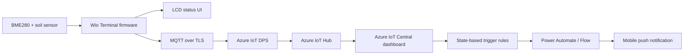
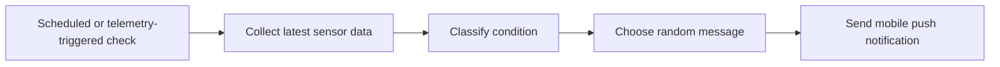

# TomatoGarden

TomatoGarden is an IoT smart-farm project built with a Seeed Wio Terminal and C++.
The device monitors a tomato plant's growing environment, visualizes the current condition on the built-in LCD, sends telemetry to Azure IoT Central, and supports mobile push notifications through cloud-side trigger rules.

## Project Summary

| Item | Description |
|---|---|
| Period | 2025.05 - 2025.10 |
| Platform | Seeed Wio Terminal, PlatformIO, Arduino/C++ |
| Cloud | Azure IoT Hub, Azure IoT DPS, Azure IoT Central |
| Goal | Measure plant environment data in real time, show the current state on LCD, and send state-based mobile alerts |
| Role | Team lead, idea proposal, Azure integration, event handling |
| Keywords | Azure, C++, LCD, Mobile notification, MQTT, IoT Central |

## LCD State Examples

| Normal | Warning | Danger |
|:---:|:---:|:---:|
|  |  |  |
| All sensors in range | Minor deviation detected | Critical soil moisture |

## Core Features

- Real-time smart-farm monitoring with temperature, humidity, and soil-moisture readings.
- LCD interface named `Tomato Guard` with sensor icons, numeric values, color status dots, and tomato character images.
- Three-level condition classification for each sensor: normal, warning, and danger.
- Overall state machine that switches the LCD tomato character between happy, sad, and danger states.
- Azure IoT DPS provisioning and Azure IoT Hub MQTT telemetry over TLS.
- Azure IoT Central dashboard support for real-time telemetry charts.
- Cloud-side trigger workflow for mobile push alerts.
- 80 custom notification messages, designed as 8 condition categories with 10 random messages each.
- USB serial CLI configuration mode for Wi-Fi and Azure IoT Central/DPS credentials.
- Remote `ringBuzzer` direct method command for testing cloud-to-device control.

## System Flow



## LCD Interface

The firmware draws the interface directly on the Wio Terminal TFT LCD.

- Title: `Tomato Guard`
- Left column: sensor icons for temperature, humidity, and soil moisture
- Center values: current sensor readings
- Status dots:
  - Green: normal
  - Orange: warning
  - Red: danger
- Direction markers:
  - `^`: value is too low and should increase
  - `v`: value is too high and should decrease
- Right side: tomato character image
  - Happy tomato for normal state
  - Sad tomato when multiple warnings occur
  - Danger image and `Warning!` text when any sensor reaches danger state

## Sensor State Logic

The firmware classifies each sensor into a numeric risk level.

| Sensor | Normal | Warning | Danger |
|---|---:|---:|---:|
| Temperature | 21-28 C | 18-20 C or 29-30 C | <=17 C or >=31 C |
| Humidity | 55-65% | 45-54% or 66-75% | <=44% or >=76% |
| Soil moisture | 430-499 raw ADC | 380-429 or 500-599 | <=379 or >=600 |

Overall LCD state is decided from the three risk levels:

| Overall state | Condition | LCD result |
|---|---|---|
| Normal | No danger and fewer than two warnings | Happy tomato |
| Sad | Two or more warning sensors, with no danger | Sad tomato |
| Danger | At least one danger sensor | Danger image and `Warning!` |

## Azure Telemetry

The device sends telemetry every 2 seconds.

```json
{
  "temp": 24,
  "humid": 60,
  "press": 1013,
  "soil": 450
}
```

Current firmware reads temperature and humidity from the BME280 sensor and soil moisture from analog pin `A1`.
The DTDL model and telemetry payload also include a `press` field for pressure data, so the Azure dashboard can keep a fixed schema.

## MQTT Topics

| Direction | Topic | Purpose |
|---|---|---|
| Publish | `devices/{deviceId}/messages/events/` | Sensor telemetry |
| Subscribe | `$iothub/methods/POST/#` | Direct method commands |
| Publish | `$iothub/methods/res/{status}/?$rid={requestId}` | Direct method response |
| Subscribe | `devices/{deviceId}/messages/devicebound/#` | Cloud-to-device messages |

## Mobile Notification Workflow

The mobile alert feature is designed outside the firmware, using telemetry from Azure IoT Central.
The firmware continuously publishes raw sensor values, and Azure rules classify the current state for notification.

Trigger process:



Message design:

- 8 condition categories
- 10 messages per category
- 80 total user-facing push messages
- Different wording for comfortable, dry, wet, hot, cold, humid, warning, and danger-like states

Example notifications:

- "뿌리까지 행복한 하루."
- "햇살도 습도도 흙도 모두 최고예요!"
- "오늘은... 정말 안 괜찮았어요. 말 걸지 마세요."

## Hardware

| Component | Interface | Role |
|---|---|---|
| Seeed Wio Terminal | MCU + LCD + Wi-Fi | Main controller and display |
| Grove BME280 | I2C | Temperature and humidity measurement |
| Soil moisture sensor | Analog `A1` | Soil moisture measurement |
| Wio buzzer | PWM | Cloud-triggered buzzer test |
| Wio buttons A/B/C | GPIO | Boot-time CLI mode and button telemetry |

## Software Stack

- PlatformIO
- Arduino framework for Seeed Wio Terminal
- Azure SDK for Embedded C
- PubSubClient for MQTT
- Seeed RPC Wi-Fi and mbedTLS libraries
- Grove BME280 driver
- TFT_eSPI for LCD drawing
- AceButton for Wio button events
- NTP for SAS token time synchronization
- MsgPack and QSPI external flash for local configuration storage

## Configuration

The default build uses `USE_CLI`.
Boot the device while holding all three top buttons to enter serial configuration mode.

Useful CLI commands:

| Command | Purpose |
|---|---|
| `show_settings` | Print saved Wi-Fi and Azure settings |
| `set_wifissid <SSID>` | Save Wi-Fi SSID |
| `set_wifipwd <Password>` | Save Wi-Fi password |
| `set_az_idscope <IdScope>` | Save Azure DPS ID scope |
| `set_az_regid <RegistrationId>` | Save DPS registration ID |
| `set_az_symkey <SymmetricKey>` | Save symmetric key |
| `set_az_iotc <IdScope> <GroupSasKey> <DeviceId>` | Configure Azure IoT Central group enrollment |
| `set_az_iotc_dev <IdScope> <DeviceId> <DeviceSasKey>` | Configure Azure IoT Central individual enrollment |
| `reset_factory_settings` | Erase saved settings |

The settings are stored in external QSPI flash using MsgPack.

## Build and Upload

Install PlatformIO, connect the Wio Terminal, then run:

```bash
pio run --target upload
```

To run the same build used by GitHub Actions:

```bash
pio run
```

## Project Structure

```text
TomatoGarden/
|-- .github/workflows/platformio.yml
|-- assets/
|   |-- azure-iot-explorer-send-command.gif
|   `-- azure-iot-explorer-telemetry.gif
|-- doc/
|   |-- get-started-guide.md
|   |-- get-started-guide.pdf
|   `-- media/
|-- include/
|   |-- Config.h
|   |-- Storage.h
|   |-- Signature.h
|   |-- AzureDpsClient.h
|   `-- imgArray.h
|-- src/
|   |-- main.cpp
|   |-- AzureDpsClient.cpp
|   |-- CliMode.cpp
|   |-- Signature.cpp
|   |-- Storage.cpp
|   |-- Bitmap.cpp
|   `-- imgArray.cpp
|-- platformio.ini
|-- seeedkk-wioterminal-wioterminal_aziot_example.json
`-- README.md
```

## Code Notes

- `src/main.cpp` contains sensor reads, LCD drawing, risk classification, telemetry publish, and direct method handling.
- `src/AzureDpsClient.cpp` wraps Azure DPS registration over MQTT.
- `src/Signature.cpp` generates SAS-token signatures with HMAC-SHA256.
- `src/CliMode.cpp` implements the serial setup console.
- `src/Storage.cpp` saves and loads configuration from external flash.
- `include/imgArray.h` and `src/imgArray.cpp` contain the bitmap arrays used for the tomato LCD states.

## Direct Method

The firmware subscribes to Azure IoT Hub direct method topics and supports:

```text
ringBuzzer
```

The payload is parsed as a duration in milliseconds, then the Wio Terminal buzzer is turned on for that duration and the device returns a method response.

## CI

The repository includes a GitHub Actions workflow that installs PlatformIO and runs:

```bash
platformio run
```
